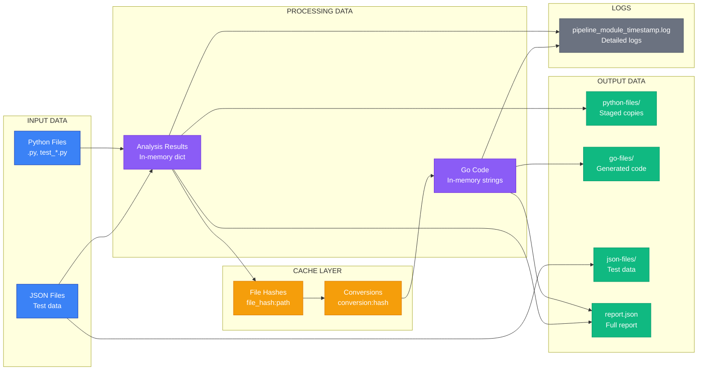

```mermaid
graph LR
    subgraph "INPUT DATA"
        PY[Python Files<br/>.py, test_*.py]
        JSON[JSON Files<br/>Test data]
    end

    subgraph "CACHE LAYER"
        REDIS_HASH[File Hashes<br/>file_hash:path]
        REDIS_CONV[Conversions<br/>conversion:hash]
    end

    subgraph "PROCESSING DATA"
        ANALYSIS[Analysis Results<br/>In-memory dict]
        CONVERSION[Go Code<br/>In-memory strings]
    end

    subgraph "OUTPUT DATA"
        PY_OUT[python-files/<br/>Staged copies]
        GO_OUT[go-files/<br/>Generated code]
        JSON_OUT[json-files/<br/>Test data]
        REPORT[report.json<br/>Full report]
    end

    subgraph "LOGS"
        LOG_FILE[pipeline_module_timestamp.log<br/>Detailed logs]
    end

    PY --> ANALYSIS
    JSON --> ANALYSIS
    
    ANALYSIS --> REDIS_HASH
    REDIS_HASH --> REDIS_CONV
    REDIS_CONV --> CONVERSION
    
    ANALYSIS --> PY_OUT
    CONVERSION --> GO_OUT
    JSON --> JSON_OUT
    
    CONVERSION --> REPORT
    ANALYSIS --> REPORT
    
    ANALYSIS --> LOG_FILE
    CONVERSION --> LOG_FILE

    classDef inputClass fill:#3b82f6,stroke:#1e40af,color:#fff
    classDef cacheClass fill:#f59e0b,stroke:#d97706,color:#fff
    classDef processClass fill:#8b5cf6,stroke:#6d28d9,color:#fff
    classDef outputClass fill:#10b981,stroke:#059669,color:#fff
    classDef logClass fill:#6b7280,stroke:#4b5563,color:#fff

    class PY,JSON inputClass
    class REDIS_HASH,REDIS_CONV cacheClass
    class PY,JSON inputClass
    class REDIS_HASH,REDIS_CONV cacheClass
    class ANALYSIS,CONVERSION processClass
    class PY_OUT,GO_OUT,JSON_OUT,REPORT outputClass
    class LOG_FILE logClass
```
